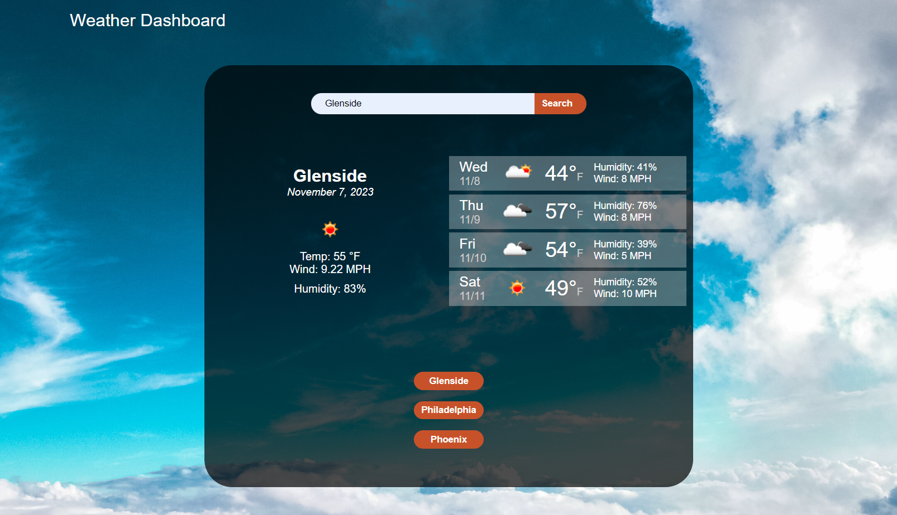

# Weather Dashboard
## Description
This application is a weather dashboard used to check the forecast. Users can search for their city and get the weather as well as the forecast for the next four days (5 day forecast is an upcoming feature). You can access the application [here](https://aaron-heath.github.io/weather-dashboard/). The application makes two API calls to OpenWeather API to get the Latitude and Longitude and then inputs those values to get the weather.

See the a screenshot below:

## Installation

N/A

## Usage

Type in the city you want to search and click the search button. The page will render weather-related information for that city. Upon subsequent searches, previous search buttons will be rendered. Clicking one of those will make a new request for that city and render it to the screen. Repeat searches for the same city will not create new buttons.

## Credits

N/A